<h1>Olá, meu nome é Thaiza Dantas! 👋</h1>

💻 Estudante de Análise e Desenvolvimento de Sistemas (UNINTER) 
🚀 Em busca da minha primeira oportunidade como desenvolvedora backend 
🎯 Foco em APIs REST, autenticação segura (JWT/OAuth2) e arquitetura limpa 
🌍 Aprendendo inglês e tecnologia, todos os dias

 

## 🛠️ Tecnologias

<table align="center">
<tr>

<td align="center" valign="top" width="25%">

### 💻 Linguagens

 Python

  

 Java

  

 SQL

</td>

<td align="center" valign="top" width="25%">

### ⚙️ Backend

&nbsp;

 
FastAPI · Spring Boot

  

&nbsp;

 
SQLAlchemy · Pydantic

  

 Alembic

</td>

<td align="center" valign="top" width="25%">

### 🗄️ Bancos

 PostgreSQL

  

 MySQL

  

 SQLite

</td>

<td align="center" valign="top" width="25%">

### 🌐 Web

&nbsp;

 
HTML5 · CSS3

  

 Swagger / OpenAPI

</td>

</tr>

<tr>

<td align="center" valign="top">

### 🔐 Segurança

&nbsp;

 
JWT · OAuth2

</td>

  

🛡️ Rate Limiting

</td>

<td align="center" valign="top">

### 🔌 API Testing

 Postman

  

 Thunder Client

</td>

<td align="center" valign="top">

### 🧪 Testes

 Pytest

  

🧪 Testes automatizados

</td>

<td align="center" valign="top">

### 🐳 DevOps

 Docker

  

 GitHub Actions

</td>

</tr>

<tr>

<td align="center" valign="top">

### 🔧 Versionamento

&nbsp;

 
Git · GitHub

</td>

<td align="center" valign="top">

### 🖥️ IDEs

&nbsp;

 
VS Code · PyCharm

  

 IntelliJ IDEA

</td>

<td align="center" valign="top">

### ☁️ Cloud

 AWS

</td>

<td align="center" valign="top">

### 🔗 API & REST

🌐 REST APIs

  

🔄 CRUD

  

📄 OpenAPI

</td>

</tr>
</table>

 

## 📊 Minha atividade no GitHub

  
  

<!-- BEGIN ACTIVITY-GRAPH -->
<picture>
  <source media="(max-width: 767px)" srcset="activity-graph-mobile.svg">
  
</picture>
<!-- END ACTIVITY-GRAPH -->

 

## 📫 Como me encontrar

  

